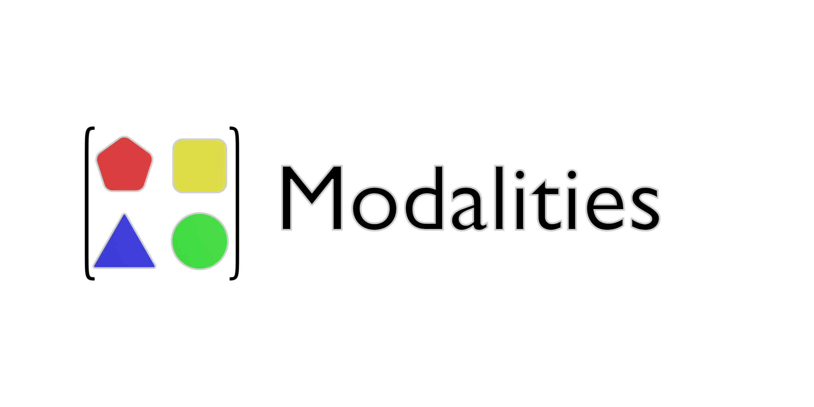

[](https://discord.gg/tbaPRNknET)
[](https://github.com/Limboid/the-limboid-ecosystem/blob/main/LICENSE)
[](https://github.com/sponsors/JacobFV)
[](https://github.com/Limboid/the-limboid-ecosystem)
[](https://github.com/Limboid/the-limboid-ecosystem)

*:construction: **This repository is under construction.** :construction: Expect a public release coming this Summer 2022.*

*Want to contribute? Check out the GitHub container repository [Limboid/the-artificial-ecosystem](https://github.com/Limboid/the-artificial-ecosystem) for this project.*

Modality primitives for building modality agnostic models and training pipelines

- Provide minimally descriptive unambiguous representation of information structure
- Support structures: flat, set, sequence, grid, and graph
- Support primitive types: boolean, categorical, range, integer, string, and real
- Support arbitrary tags: context, human_label, learned_embedding, etc.
- make pypi and npm packages

A modality is a pytree dict containing semantic information and optional structural information (to disambiguate ordering of elements).

- Modality: structural (`set<T>`, `int16`, `string`) and semantic information ("the location of the robot") about the port’s data

```python

class Modality(pytree):
  ... pytree attrs
  

class PrimitiveModality(Modality):
  ... Modality attrs
  ... pytree attrs
  ordering


@ordering('ltr'|'rtl'|None)
@ordering([..., 1, -1, 0])
# batch dimension indicator `...` inferred at left end if not specified
# -3 axis goes forward
# -2 axis goes backward
# -1 axis has no ordering

# this should be in tensorcode (instead? or as well?)
# the label can be hand-specified or learned
@label(label: str|any, obj: any)

# Q. how do I indicate that a pytree represents a graph?
# A. since graphs have a very particular interpretation, just make a custom type
class Graph(pytree):
  def __init__(self, V, E):
    super().__init__(dict(V=V, E=E))

# need to specify if a tensor (not modality tree) represents nominal, ordinal, interval, or rational data


@modality(ordering: pytree[int|None] = None, label: pytree[any] = None, stat_type: pytree['n'|'in'....] = None)

```

- meta: semantic information
- grouping: describes structural interpretation of tensor axes expressed in jagged lists of groups (or just plain list if all axes are in separate groups)
- stat: statistical information. List items are -1 for reverse, 0 for no ordering, 1 for forward ordering.
  : Nominal(options: list|slice|set|dict), shorthand: set or slice. Used by categorical models
  - Dist:
  : Ordinal(options: list|slice|set|dict), shorthand: list. Useful in some scenarios
  : Interval(low, high), shorthand: int tuple. I don't know where this would be useful. Most models will interpret it the same way they interpret rational values.
  : Rational(low, high), shorthand: float tuple

- distribution (uniform, normal, exponential, log-normal, etc.)
- orientation: centered | positive
